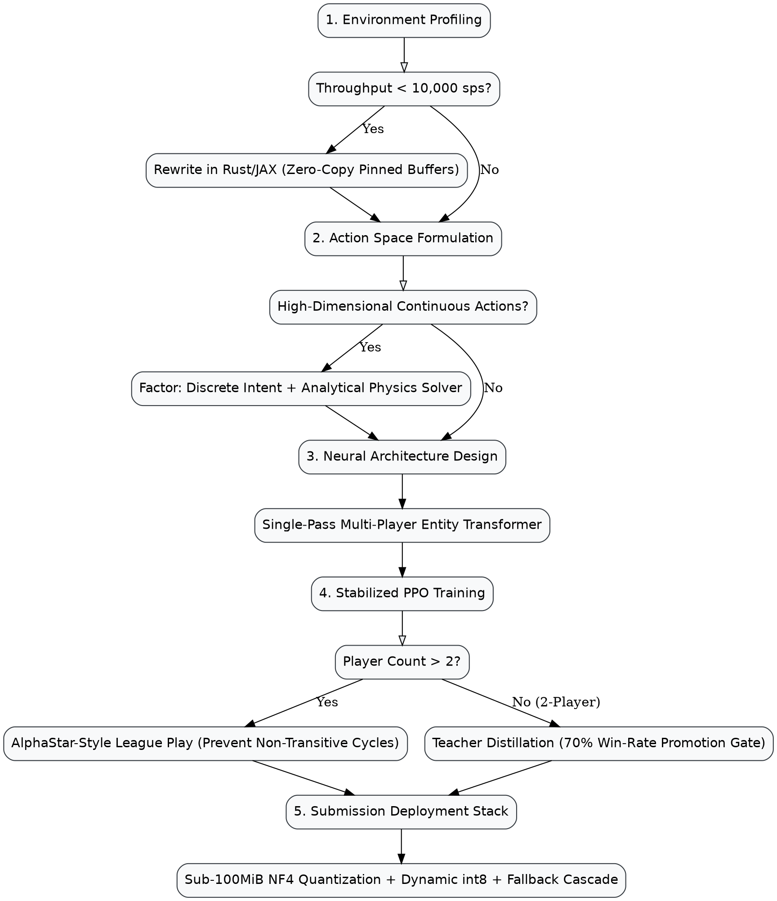

# Competitive Reinforcement Learning & Simulation Playbook 🚀

## Overview

Competitive game and simulation challenges on Kaggle (e.g. Orbit Wars, Lux AI, Kore, Halite, Google Football) present a fundamentally different paradigm from tabular or static vision/NLP tracks. Success is governed by **Sutton's Bitter Lesson**: *expressive neural architectures and extreme simulation throughput scale far higher than hand-crafted human heuristics*.

This skill operationalizes the complete engineering lifecycle to develop, train, stabilize, and deploy gold-medal reinforcement learning agents under strict submission constraints.

---

## The 5-Phase Competitive RL Protocol

### Phase 1: Environment Diagnostics & Acceleration
*Before writing neural network code, benchmark the raw simulation.*
1. **Benchmark Baseline Throughput**: If the official Python environment runs below $5,000\text{ steps/sec}$, full self-play will fail to converge within reasonable compute budgets.
2. **Native Rewrite**: Port the simulation core to **Rust** (PyO3 + Rayon) or **JAX**.
3. **Zero-Copy Memory Protocol**: Preallocate pinned CPU memory buffers wrapped directly by PyTorch tensors without Python GC pauses or data duplication.
4. **Replay Parity Gate**: Validate that the compiled engine reproduces official tournament match JSON replays bit-for-bit across every turn.
> **Detailed Guide:** See [`references/simulator_acceleration.md`](references/simulator_acceleration.md) for Rust Rayon bindings, AABB collision broad-phase filtering, and parity regression harnesses.

---

### Phase 2: Observation & Action Space Structuring
*Structure representations to maximize learnability and minimize sample complexity.*
1. **Entity-Based Observations**: Represent game boards as sets of distinct entity tokens (planets, units, obstacles) rather than rigid spatial grids.
2. **The Discrete Intent Factorization**:
   - Continuous raw physical angles and velocities frequently fail to learn complex orbital/ballistic mechanics.
   - **Recipe**: Let the neural policy predict high-level discrete tactical intent (`source_entity`, `target_entity`), and embed a deterministic analytical solver in the environment to compute the exact physical trajectories.
3. **Continuous Bounded Sizing**: For continuous allocations (e.g. ship count or bid percentage), use a **Truncated Discretized Logistic Mixture Head** over the valid dynamic range $[S_{\min}, S_{\max}]$.

---

### Phase 3: Neural Policy Architecture
*Deploy scalable, permutation-invariant multi-agent models.*
1. **Unified Multi-Entity Transformer**:
   - Independent MLP stems project distinct entity types into a shared embedding space ($D=256 - 768$).
   - Pre-norm residual Transformer trunk (12 to 38 blocks, 8 to 16 attention heads).
2. **Specialized Control & Workspace Tokens**:
   - **Player Summary Tokens**: Encodes macro economy, alive status, and player identity.
   - **Global Summary Token**: Encodes turn clock, step counter, and game phase.
   - **Board Scratch Tokens**: Learned embedding vectors that serve as a shared global workspace for inter-entity attention without supervisory loss.
3. **Single-Pass Multi-Player Evaluation**:
   - Compute actions and win probabilities for all active players in **one single forward evaluation**, cutting training and rollout compute by $2\times - 4\times$.
4. **Multi-Player Softmax Value Critic**:
   - Predict the joint categorical win probability distribution over active players ($\sum \hat{p}_i = 1$).
> **Detailed Guide:** See [`references/model_architectures.md`](references/model_architectures.md) for PyTorch implementations of entity transformers, attention target selection, and mixture heads.

---

### Phase 4: Distributed PPO & Training Stabilization
*Scale policy optimization without catastrophic forgetting or non-transitive degeneration.*
1. **Distributed Scaled PPO**:
   - Vectorize across $2,048 - 8,192$ parallel environments with $T=64$ rollouts.
   - Single-epoch PPO updates to prevent overfitting to recent trajectories.
   - **Muon + AdamW Optimizers**: Use Muon for 2D attention/linear matrices ($\ge 25M$ params) and AdamW for 1D embeddings/biases.
2. **Teacher Distillation Anchor**:
   - Anchor policy updates against a historical `checkpoint_last_best.pt` using Policy KL-divergence and Critic Cross-Entropy loss terms.
   - **The 70% Promotion Gate**: Replace the teacher checkpoint **only** when a candidate achieves $\ge 70\%$ win rate across 2,048 evaluation games.
3. **Game-Theoretic Dynamics (2-Player vs Multiplayer)**:
   - **2-Player**: Pure self-play with teacher distillation converges to robust minimax policies.
   - **Multiplayer (3+ Players)**: Pure self-play risks non-transitive Rock-Paper-Scissors cycles. Implement **AlphaStar-Style League Play** against diverse historical checkpoints and exploiters.
4. **Reward & Termination Engineering**:
   - Avoid undiscounted $\gamma=1.0$ without termination penalties (prevents the "Stalling Bug").
   - Do **not** mask suicidal or illegal actions during early training; unmasked failures force the model to internally represent environment physics.
> **Detailed Guide:** See [`references/rl_training_stability.md`](references/rl_training_stability.md) for PPO hyperparameter tables, promotion gauntlets, and league matchmaking algorithms.

---

### Phase 5: Submission Packaging, Quantization & Latency Guardrails
*Navigate strict Kaggle sandbox constraints ($\le 100\text{ MiB}$ file size, $1.0\text{s}$ turn latency on slow CPU).*
1. **Checkpoint Compression**:
   - Quantize 2D linear weights using **4-bit NormalFloat (NF4/NF5)** with group size 128 and Least-Squares (LSQ) scale refinement.
   - Compresses 200M parameter models ($800\text{ MiB}$) down to **$90.7\text{ MiB}$**, fitting comfortably inside the 100MiB archive cap while retaining ~40% win rate against unquantized fp32.
2. **Streaming Dequantizer**:
   - Load and dequantize tensors one-by-one at container startup directly into model buffers, avoiding full state-dict memory spikes.
3. **Dynamic int8 CPU Inference**:
   - Convert non-output linear layers to signed int8 via `torch.ao.quantization.quantize_dynamic`, cutting inference latency from $2,500\text{ ms}$ to $<450\text{ ms}$.
4. **Circuit-Breaker Fallback Cascade**:
   - Monitor `observation.remainingOverageTime`.
   - If overage time drops below $1.0\text{ second}$, immediately trigger an automatic handoff to a packaged, lightweight $5\text{M}$ parameter model ($<30\text{ ms}$ inference).
> **Detailed Guide:** See [`references/submission_quantization_serving.md`](references/submission_quantization_serving.md) for complete NF4-LSQ encoders, streaming loaders, and dual-model fallback wrappers.

---

## Quick Reference & Hyperparameter Cheat Sheet

| Problem Domain | Recommended Solution | Key Parameters / Code Reference |
| :--- | :--- | :--- |
| **Simulator Throughput** | Rust (PyO3 + Rayon) / JAX | `par_iter_mut()`, preallocated pinned CPU buffers (`pin_memory=True`) |
| **Variable Entity Boards** | Entity-Centric Transformer | Shared 768-d embedding, 17 special tokens (Player, Global, Scratch) |
| **Action Generation** | Discrete Intent + Solver | $Q \cdot K^T / \sqrt{d}$ target selection + analytical physical intercept |
| **Continuous Fleet Sizing** | Truncated Logistic Mixture | 8 components over $[S_{\min}, S_{\max}]$, normalized sigmoid means |
| **Optimization Stability** | Last-Best Teacher Distillation | $\alpha_{\text{KL}} D_{\text{KL}}(\pi_{\text{teacher}} \|\, \pi) + \alpha_{\text{CE}} \mathcal{L}_{\text{CE}}$, promote at $\ge 70\%$ win rate |
| **Multi-Player Dynamics** | AlphaStar League Play | 50% self-play, 35% historic checkpoints, 15% exploiters |
| **100MiB Submission Cap** | Grouped NF4-LSQ Codebook | Group size 128, fp16 scales, least-squares scale fitting ($90.7\text{ MiB}$) |
| **CPU Latency Budget** | Dynamic int8 + Fallback | `quantize_dynamic(model, {nn.Linear}, qint8)` + 5M model fallback if bank $<1.0\text{s}$ |

---

## Common Mistakes & Anti-Patterns

| Anti-Pattern | Why It Fails | Battle-Tested Fix |
| :--- | :--- | :--- |
| **Premature Action Masking** | Masking illegal/suicidal actions early prevents the neural net from internalizing physical game boundaries. | Train **unmasked** during exploration so the network learns physics; introduce masks only for final fine-tuning and test serving. |
| **Undiscounted Stalling ($\gamma=1.0$)** | With no temporal penalty, winning bots hoard units and stall for hundreds of turns rather than finishing matches. | Set $\gamma = 0.99$ or add a mild per-turn step cost ($r_t = -0.001$), or add automatic win declaration upon high win-probability persistence. |
| **Pure Self-Play in Multiplayer ($N \ge 3$)** | Multi-agent environments have non-transitive dynamics; pure self-play leads to circular overfitting (Rock-Paper-Scissors). | Implement League Play against diverse historical checkpoints and specialized exploiter agents. |
| **Single-Player Forward Evaluation** | Running $N$ separate forward passes per state wastes $2\times - 4\times$ rollout compute and GPU VRAM. | Unified Single-Pass Transformer: Concatenate all players' tokens into one sequence and predict all policies simultaneously. |
| **Uniform INT4 Quantization** | Naive uniform quantization destroys attention weight distributions, causing catastrophic policy collapse. | Use **NormalFloat 4 (NF4)** codebook quantization with group size 128 and Least-Squares (LSQ) scale refinement. |
| **Full State-Dict Deserialization** | Dequantizing the entire 800MiB model at once on Kaggle CPU causes out-of-memory container crashes. | Use **streaming dequantization**, reconstructing one parameter tensor at a time directly into preallocated model storage. |
| **Unprotected CPU Latency** | Relying solely on a heavy model risks disqualification if Kaggle assigns a throttled CPU core. | Implement a **circuit-breaker fallback cascade**: auto-switch to a sub-5M model when bank overage drops below $1.0\text{ second}$. |

---

## Complete Competition Case Studies

- **Orbit Wars (1st Place)**: [Deep Dive Post-Mortem](../../../Handbook/reinforcement-learning/orbit-wars.md) — 200M Transformer, 15B steps, Rust engine acceleration, NF4-LSQ compression, dynamic int8 CPU serving, and fallback cascades.
