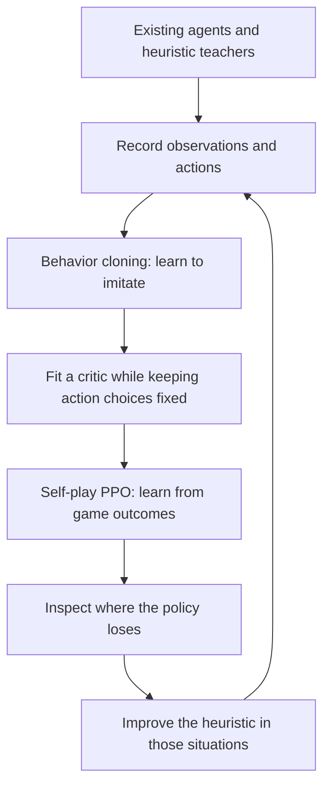

# Kaggriculture explained: from action tapes to a learned farming agent

The M & M & P & Q solution starts by **learning to imitate existing agents**, then improves through games against itself. When the learned agent fails in particular farming situations, the team improves a rule-based teacher, generates more examples and trains again. Rules and search also help turn the model's choices into useful actions during a match.

If you already use a public tape notebook, your agent can become both a comparison opponent and a source of training examples. The first useful milestone is a small model that makes decisions from the farm's actual condition and plays complete games. The team's final model is a later, much larger version of that idea.

**Scope:** advanced `kaggriculture`. **Evidence snapshot:** October 2, 2026; explanation revised October 4. The team described its result as *current first place* at the snapshot date; final placing was not established. [Team discussion](https://www.kaggle.com/competitions/kaggriculture/discussion/745073).

## How to read this

- **Learning the idea:** read sections 1–6 in order. They explain the game, tapes, imitation, reinforcement learning and the final agents.
- **Building from a tape:** continue through sections 7–8, then use the [implementation skill reference](../../.agent/skills/kaggle-rl-simulation/references/kaggriculture.md) for commands and correctness checks.
- **Checking exact claims:** use the appendices for model dimensions, replay alignment, training settings, source audits and links to the original diagrams.

The team's reported training history, behavior found in source code, and proposed starting experiments are identified separately below. No model was trained or benchmarked for this handbook.

## 1. What the agent is trying to do

Each player runs a farm. You choose what to grow, where the farmer and workers go, when to harvest, what to buy and when to sell. You want to finish the season with more banked money than the other player. The official environment reports each player's money; the competition turns the comparison into a win, draw or loss. [Official evaluation](https://www.kaggle.com/competitions/kaggriculture/overview/evaluation).

The farms are separate, but the economy connects them. Both players' trades and the town's consumption affect prices. A productive farm can still lose money through poor timing, storage overflow or goods that never reach the shed before the season ends.

An **observation** is the information the agent can see when choosing an action. It includes its own farm and inventories, market information and public parts of the opponent's farm. The opponent's shed, seeds and carried inventories are private. A model must make decisions from this available information.

One turn combines a farmer action, worker actions and up to ten market orders. A **replay** records a game's states and actions. A full game has **719 decisions per player**, stored as **720 replay states** because the replay also includes the initial state. That is why data preparation and endgame timing need careful indexing.

Shops appear randomly and can repeat. Weeds also introduce randomness. These changes make reacting to the farm's current condition useful, even when a planned schedule is strong.

## 2. What changes when you move from tapes to learning

A **policy** is the rule or model that chooses actions. The following are three ways to implement one:

| Policy type | How it chooses | What changes when the farm differs from the plan? |
| --- | --- | --- |
| Action tape | Replays a prepared schedule, often choosing a route from early shop information | Runtime guards can repair the schedule, but its main plan comes from a finite library |
| Heuristic | Computes actions using rules written by a person, such as job priorities or sale thresholds | Rules react to the current farm; their priorities are designed by the author |
| Learned policy | A model receives the observation and scores possible actions | Training teaches the model how its choices should depend on the current farm |

These approaches can be combined. A tape with storage guards remains a tape-based controller. A neural model with rules for legal actions remains a learned controller. Having many rules does not by itself tell you whether an agent uses reinforcement learning.

**Illustrative situation:** a scheduled harvest arrives, but a crop is not ready and the shed is nearly full. A tape guard might skip the harvest. A heuristic could assign watering or delivery instead. A learned policy can use crop state, storage, prices and time remaining to choose among those alternatives. Whether it chooses well depends on its training and must be checked in games.

The central change is the training example:

```text
input:  the observation the teacher actually saw
target: the valid action the teacher chose in that situation
```

The input is the actual farm, including deviations caused by weeds, prices and earlier actions. A turn number alone cannot explain those deviations.

## 3. How the team's training loop works

The team alternated imitation, game-based improvement and better demonstrations. The diagram below summarizes that process; the explanations beneath it also work without a diagram renderer.



### Step 1: imitate a teacher with behavior cloning

A **teacher** is an existing agent whose decisions supply examples. **Behavior cloning (BC)** trains a model to predict those decisions from observations. It is supervised learning: the model sees what the teacher did, rather than discovering farming from random actions.

This gives the model a starting strategy. It also passes on the teacher's weaknesses. Test the student in complete games: once it makes a different choice, its next observation may differ from anything in the teacher's replay. Good action-prediction accuracy alone does not show that it can run a farm.

### Step 2: teach a separate output to judge positions

The **actor** is the part of the model that chooses actions. The **critic** estimates the eventual outcome from the current position. PPO uses that estimate to judge whether a result was better or worse than expected.

BC teaches action choices but does not train the team's value output. The team therefore collected fresh games and fitted the critic while keeping the actor and shared network fixed. This preserves the strategy learned through imitation while preparing an outcome estimate for reinforcement learning.

### Step 3: improve through self-play PPO

**Reinforcement learning (RL)** trains from the consequences of the agent's own actions. **Self-play** means the current policy controls both players during training games. In this release, it does not mean that every game is played against a fixed teacher.

**Proximal Policy Optimization (PPO)** uses saved action probabilities and game outcomes to update the policy. Its clipped objective discourages excessively large changes to action probabilities in one update. It does not guarantee that every update improves match strength.

The team's teacher also acts as an anchor: a penalty discourages the new policy from moving too far from the teacher's action distribution. This is **KL regularization**, named for Kullback–Leibler divergence, a measure of how distributions differ. Here it anchors the policy's choices; it does not choose the opponent.

The training reward is `+1` for a win, `0` for a draw and `-1` for a loss. The released recipe uses `gamma=1`, meaning it does not discount an outcome merely because it occurs later. This fits a season with a fixed ending; an early-victory bonus from a combat game would change the farming objective.

### Step 4: use failures to improve the next teacher

The team found weaknesses in tomato-heavy and strongly repeated shop configurations. They improved their heuristic planner for those situations, generated more demonstrations and returned to BC and PPO.

This loop makes failure analysis productive: identify a specific farming situation, improve the behavior taught there, and check whether the next learned policy benefits. Increasing model size is only one possible change.

These steps explain the [original training-loop diagram](https://github.com/msdsm/kaggriculture-solution/blob/84057a0fda4238ccdebc46f9bf5496c6c4b2e00d/docs/images/overview.png). Exact settings are in [Appendix C](#appendix-c-ppo-settings-and-probability-checks).

## 4. Why choosing legal actions is harder than it looks

The farmer, workers and market orders use shared resources. An action that is legal by itself may become impossible when combined with another action.

**Worked example using the pinned rules:** you have one tomato seed. The farmer and a worker stand on separate plantable tiles and both request planting. Each request needs one seed and looks valid alone. Together they need two. The official interpreter rejects **all tomato planting requests** when combined demand exceeds available tomato seeds. Neither plant succeeds.

Buying another tomato seed in that turn does not fix the requests: unit actions execute before market orders. The new seed becomes available for later work.

An **action mask** marks choices that are unavailable. A sequential mask can first allow the farmer to plant, reserve the seed, then prevent the worker from spending the same seed. The worker chooses something else. Market decoding similarly accounts for stock or money reserved by earlier orders.

Masking enforces feasibility; it does not decide whether planting is profitable. Workers are allowed to share a position, so a blanket rule that forbids shared squares would impose an extra restriction the game does not have.

**Sampling** means drawing an action from the model's probabilities. **Temperature** adjusts how concentrated or spread out those probabilities are. Training must remember how a choice was made: use the same masks and temperature when recomputing its probability. If a repair replaces a proposed action, keep the proposed and executed actions distinguishable; do not record the replacement as though the model sampled it.

This bookkeeping is essential for PPO. Training charts can improve even when an intended model output never changes the action sent to the environment. [Appendix D](#public-trainer-audit-identify-the-exact-snapshot) gives a concrete public-source example.

## 5. What the public notebooks actually do

The six examples below were inspected from downloaded source on October 2. They represent different approaches; notebook titles and tags are insufficient to classify them. Linked training files can also change independently of a notebook.

| Inspected example | How it works | What it teaches us |
| --- | --- | --- |
| [Official Getting Started](https://www.kaggle.com/code/bovard/kaggriculture-getting-started) | Rules for melon farming, movement, watering, harvesting and threshold sales | A clear API baseline; it does not cover the complete worker, animal and economic problem |
| [AgroBoss](https://www.kaggle.com/code/songoku2005/kaggriculture) | Assigns jobs greedily from the current farm state; no learned model | Reactive farming is possible with hand-written rules. Its full-observability description conflicts with the private inventories in the official rules |
| [Adaptive Farming Strategy](https://www.kaggle.com/code/tetsutani/adaptive-farming-strategy-for-kaggriculture) | Selects among five season tapes from early shops, then applies runtime guards | A finite plan library can include substantial adaptation without BC or RL |
| [Multi-Route Farming Agent](https://www.kaggle.com/code/flexonafft/kaggriculture-multi-route-farming-agent) | The extracted V43 agent combines tapes, shop-pair routing and reactive economic/endgame rules | A sophisticated controller can remain tape-based; no training occurs in the inspected notebook |
| [Public PPO training example](https://www.kaggle.com/code/alejandrofonda/kaggriculture-ppo-training) | A small economic model attached to scripted farming; the inspected updater has policy-gradient behavior | A reduced action space is a useful starting idea, but this snapshot has algorithm and execution bugs; see the audit below |
| [What 2600+ Farms Do Differently](https://www.kaggle.com/code/georgymamarin/kaggriculture-what-2600-farms-do-differently) | Analyzes replays, strategy patterns and agent lineage; trains no agent | Useful for finding opponents and failure patterns. Correlations in sampled replays do not establish what caused strength |

The [M & M & P & Q release](https://github.com/msdsm/kaggriculture-solution/tree/84057a0fda4238ccdebc46f9bf5496c6c4b2e00d) learns both unit and market choices from the observation, estimates game outcome, and improves through self-play. Its rules and planners serve two roles: creating better training examples and supporting decisions during matches.

This source comparison establishes differences in implementation. It is not a head-to-head ranking of the agents.

## 6. Final A and Final B use the model differently

The final agents have the same published network dimensions, but different control procedures and training histories. A **controller** includes everything between the model's prediction and the action actually sent to the game.

| Question | Final A | Final B |
| --- | --- | --- |
| How are unit choices made? | Takes the highest-scoring neural choices, then repairs them in confidence order | Chooses the farmer, then workers, reserving resources before each next choice |
| How are inventory problems handled? | Repairs seed conflicts, can insert a useful seed purchase, and sells overflow while keeping wheat for feed | Uses rule-aware masks and learned purchase choices; forced sales/drop are handled explicitly |
| What happens on the final day? | Can hand control to a C++ planner for tasks, routes, delivery and trades; falls back to neural control if the planner cannot run within budget | Neural controller plays the whole season; no final-day search handoff |
| What matters for reproduction? | The packaged agent includes repair and planner behavior | Additional PPO trained with the sequential masks; changing an inference flag alone does not reproduce those weights |

For B, PPO excludes deterministic forced SELL/DROP factors from the actor loss, while their effects still contribute to the critic's outcome targets. Otherwise, the model would be credited with choosing an action that the rules forced.

Final-day dawn is day **29** under zero-based day numbering. This timing and the controller differences are described in the [architecture and controller documentation](https://github.com/msdsm/kaggriculture-solution/blob/84057a0fda4238ccdebc46f9bf5496c6c4b2e00d/docs/architecture.md).

## 7. A practical route from your tape to a learned agent

The following is a proposed starting experiment, not the team's complete historical recipe. Begin with a **small learned market controller plus workers managed by state-aware rules**. Learn a few economic decisions while keeping movement, watering, feeding and delivery understandable.

A learned purchase can invalidate the rest of a tape: buying a worker or different seeds changes the situation assumed by later scheduled actions. Use a reactive worker scheduler or explicitly compatible tape variants when adding learned decisions.

| Stage | Produce this | Evidence that the stage works |
| --- | --- | --- |
| Preserve the teacher | Exact tape source and full-game results against distinct active opponents | A stable comparison using the same random seeds in both player positions |
| Collect demonstrations | Actual observations paired with valid teacher actions, split by whole game | Correct replay alignment, explicit teacher identity and no game shared between training and validation |
| Train a small BC controller | A model whose selected economic actions reach the game | Complete games unused for training and useful buying/selling behavior; report rare decisions separately from PASS/NONE accuracy |
| Fit the critic, then add PPO | Saved probabilities and outcomes, plus a critic trained on fresh games | Probability recomputation agrees before an update; policies are evaluated against the external opponent panel |
| Diagnose and expand | Failure examples grouped by shop mix, game phase and opponent | Targeted demonstrations or a larger model improve measured match outcomes |

On a host with about 32 GB RAM, a proposed initial subset is **32–64 teacher trajectories**. The release's full dataset expands to about **63.5 GiB of feature arrays alone** and its loader reads them into host memory. GPU memory does not replace host RAM. Use a subset or a bounded loader before trying the full recipe.

Measure simulation, converting observations to numeric inputs (**feature encoding**), running the model to choose actions (**inference**) and training updates separately. A **rollout** is a batch of games collected for training. A GPU does not automatically speed up a Python simulator. Grow the model or rollout only after the experiment fits in memory and the measured throughput supports it.

For the release's JAX/NVIDIA stack, the support matrix checked on October 4 lists native Windows GPU support as unavailable and WSL2 as experimental. Verify the chosen environment with device discovery and a compiled forward/backward pass before a training run. Final A's submission planner needs a Linux x86-64 binary. [JAX installation](https://docs.jax.dev/en/latest/installation.html), [release setup](https://github.com/msdsm/kaggriculture-solution/tree/84057a0fda4238ccdebc46f9bf5496c6c4b2e00d).

The release contains training and inference code. Its historical weights, replay datasets and multi-host scheduling are not bundled. Following the source produces a new training run, not the original trained agent.

## 8. What a human or AI implementer should check next

Identify the current tape, advanced environment version, available RAM/VRAM and intended learned decisions. Then use the [Kaggriculture implementation reference](../../.agent/skills/kaggle-rl-simulation/references/kaggriculture.md) for the stage being implemented.

For a first BC experiment, the useful handoff consists of the teacher's identity, the replay index and game-level split, the action-to-execution mapping, and complete held-out match results. For PPO, add the saved probability/mask checks and terminal-return checks. Report training settings as proposals or measured results according to which they are.

Evaluate against distinct active tape, heuristic and frozen-policy opponents. For each random seed, play both seat assignments: the seed fixes randomness, and swapping seats tests both player positions. Keep a final seed/opponent panel untouched during development.

Record win/draw/loss, money margin within each game, failed actions, unsold or wasted inventory, and action latency. Earnings against PASS or a mirror game do not establish competitive strength. If estimating uncertainty, keep both matches of a swapped-seat seed pair together during resampling.

The first milestone is a small BC policy that makes its intended decisions and completes unseen games with useful teacher-relative performance. Use that result to decide how much PPO or model growth to attempt.

## Appendix A: model and training scale

A **Transformer** lets representations of different game entities exchange information. A **token** here is one encoded entity, such as a farm cell or worker, rather than a word. Separate output **heads** score unit actions, market orders and value from the shared representation.

| Entity represented | Maximum tokens | Purpose |
| --- | ---: | --- |
| Farm cells across both farms | 200 | Crop, terrain and spatial state |
| Units across both players | 40 | Farmer and worker state |
| Global state | 1 | Season and overall economic context |
| Commodities and animals | 12 | Economic and production information |
| Opponent-inventory estimate | 1 | Rule-updated estimates and uncertainty from public evidence |
| Market-order slots | 10 | Represent the ordered trade decisions |
| Total | 264 | Typed inputs to the shared network |

The common feature layout has 124 columns; each token type selects relevant columns before projection. The opponent-inventory estimate is neither access to private inventories nor recurrent neural hidden state.

Both final networks have **10,225,070 parameters** (learnable model values), 12 blocks, width 256, eight attention heads and feed-forward width 1,024. They use pre-LayerNorm, GELU, zero dropout and selective 2D rotary positional encoding (RoPE) for spatial relations. Each own unit has 500 candidate scores. Each of ten market slots decodes 1,903 choices: 1,003 non-SELL choices plus nine commodities × 100 absolute SELL quantities. [Architecture](https://github.com/msdsm/kaggriculture-solution/blob/84057a0fda4238ccdebc46f9bf5496c6c4b2e00d/docs/architecture.md), [original model diagram](https://github.com/msdsm/kaggriculture-solution/blob/84057a0fda4238ccdebc46f9bf5496c6c4b2e00d/docs/images/model_detail.png).

Final A's adopted training ancestry totals **8,290,767 self-play games**, or **11,922,122,946 player decisions** at 1,438 decisions per game. Parallel larger-model branches share ancestors, so summing all branches would count some experience more than once. Some larger-branch counts include post-deadline work. The final submitted networks were about 10.23M parameters; the explored 20M family was not the final model. Final B's additional step count was not recovered. [Training lineage](https://github.com/msdsm/kaggriculture-solution/blob/84057a0fda4238ccdebc46f9bf5496c6c4b2e00d/docs/training-lineage.md), [original chronology diagram](https://github.com/msdsm/kaggriculture-solution/blob/84057a0fda4238ccdebc46f9bf5496c6c4b2e00d/docs/images/training_detail.png).

These counts describe training scale. There is no published controlled comparison assigning a specific strength gain to model size, more games or an individual rule.

## Appendix B: replay data and memory

A **replay** is a recorded game. A **seat** is one of the two player positions. A **trajectory** here is one teacher seat's sequence of observations and actions. One game can therefore supply two teacher trajectories.

For the pinned full replay format, use:

```text
input  = steps[t][teacher_seat].observation
target = steps[t + 1][teacher_seat].action
```

The action is stored with the next recorded state. Using observation and action from the same replay index would misalign the example. Explicitly identify the teacher seat; do not assume the winner is the intended teacher.

The preparation scripts verify version, replay hash and 720-state length, deduplicate game/seat rows, and filter invalid or unexecuted labels. SELL labels use executed absolute quantity. Both seats of one game stay in the same training or validation split so that nearly identical states do not leak across that boundary.

The final BC recipe contained 849 public trajectories plus 600 synthetic trajectories from both seats of 300 heuristic games. Those games comprised 100 normal scenarios, 100 with at least two tomato-related shops and 100 with at least three copies of one shop. Scenario overrides generated teaching examples; final evaluation kept normal randomness. [Data preparation](https://github.com/msdsm/kaggriculture-solution/blob/84057a0fda4238ccdebc46f9bf5496c6c4b2e00d/docs/data.md).

The cached feature array per trajectory uses half-precision floating-point numbers (FP16) and shape `[719,264,124]`: decisions × tokens × feature columns. At two bytes per value:

```text
719 × 264 × 124 × 2 = 47,074,368 bytes ≈ 44.9 MiB
1,449 trajectories ≈ 63.5 GiB of features
```

These are calculations from source shapes, not memory measurements. Labels, masks, single-precision (FP32) training batches and model activations add overhead. The loader eagerly reads feature arrays; compressed NPZ files are not directly memory-mapped. [Released loader](https://github.com/msdsm/kaggriculture-solution/blob/84057a0fda4238ccdebc46f9bf5496c6c4b2e00d/python/kaggriculture/data/dataset.py).

## Appendix C: PPO settings and probability checks

These are the inspected release's defaults, not a claim that they are optimal for a smaller controller.

| Setting | Released value | Meaning |
| --- | --- | --- |
| Terminal reward | Win/draw/loss `+1/0/-1` | Learn relative match outcome |
| Discount `gamma` | `1` | Keep delayed terminal outcomes undiscounted |
| GAE `lambda` | `0.97` | Generalized Advantage Estimation: combines future reward/value errors |
| PPO clip | `0.2` | Clipping parameter for the policy objective |
| PPO epochs per rollout | `1` | One pass over each collected training batch |
| Value loss | Huber, weight `2` | Fit the critic with a loss less sensitive to large errors than squared error |
| Teacher KL | `KL(teacher ∥ policy)`, coefficient `0.2` | Anchor choices to the reference policy |
| Unit/market entropy | `0.0015` each | Encourage diversity in action distributions |
| Optimizer | Adam, epsilon `1e-5` | Parameter update rule |
| Gradient-norm clip | `5` | Limit gradient magnitude |
| Base learning rate | `5e-5` | Update scale before the learning-rate schedule |
| Example rollout | 64 full games, both seats | 92,032 player decisions; a public preset rather than the historical cluster setup |

**Advantage** estimates how much better an outcome was than the critic expected. PPO-Clip compares the probability of the sampled action under the updated policy with its saved probability at collection time:

```text
ratio = exp(new_log_probability - old_log_probability)
objective = min(ratio * advantage,
                clip(ratio, 1 - 0.2, 1 + 0.2) * advantage)
```

Before changing any weights, recomputation should agree with the saved probabilities and the ratio should be approximately one. Use matching conditional masks and temperature. The joint action's log probability is the sum of the log probabilities of its active learned factors; padding and deterministic forced factors are excluded. Preserve full terminal outcomes when constructing returns.

The rollout configuration requires `inference_batch_size = 2 * games` and `games % segments_per_minibatch == 0`, with complete seat pairs in shards and microbatches. The team's critic uses paired seats for zero-sum values: the two players' estimates are opposites. [Training settings](https://github.com/msdsm/kaggriculture-solution/blob/84057a0fda4238ccdebc46f9bf5496c6c4b2e00d/docs/training.md), [objective implementation](https://github.com/msdsm/kaggriculture-solution/blob/84057a0fda4238ccdebc46f9bf5496c6c4b2e00d/python/kaggriculture/training/objectives.py), [PPO paper](https://arxiv.org/abs/1707.06347).

At `gamma=0.99`, a reward 718 decisions away gets weight `0.99^718 ≈ 0.00074`. Discounting or adding intermediate money rewards therefore changes which investments the policy values. Treat such changes as experiments evaluated by full match outcomes.

## Appendix D: public trainer audit

### Public trainer audit: identify the exact snapshot

The [public training notebook](https://www.kaggle.com/code/alejandrofonda/kaggriculture-ppo-training) links a [trainer dataset](https://www.kaggle.com/datasets/alejandrofonda/kaggriculture-ppo-model). Its downloaded `train_rl.py` had SHA-256 `696d00f8cee6b117e789b0b7b34592805bfda6a15c9597ecfc6a1dc6c409ebda` on October 2, 2026. Findings below apply to those file bytes.

The model is a small two-layer, width-128 multilayer perceptron (MLP), a feed-forward neural network: 48 inputs, five sell choices, three buy choices and a value output, totaling 23,945 parameters. The buy choices are NONE, GOOSE and LAND; other farming behavior is scripted. The notebook requests 20 BC episodes and 300 fine-tuning episodes, then evaluates own money on eight seeds against its “random” path.

| Finding in the inspected file | Code evidence | Why it matters |
| --- | --- | --- |
| No PPO ratio or clipping | `ppo_update`, lines 684–717, uses `-log_prob * advantage` without saved old probabilities | It is a policy-gradient update, not PPO-Clip |
| Different sampling and update distributions | `run_episode` uses masked logits and changing temperature; the updater scores raw logits | Updates do not evaluate the same action distribution used to collect data |
| SELL mask prefix is duplicated | Near line 602, `SELL_` is added to choices already named `SELL_MELON`, etc. | Learned non-NONE sell choices are masked out |
| Learned sell choice never reaches execution | `make_sell_orders`, lines 465–475, never reads `sell_act` | Fixing the mask alone still gives the sell head no control over emitted sales |
| “random” opponent is inactive | Nested `random_agent`, lines 647–648, returns PASS and empty worker/market orders | Own earnings against it do not measure strength against an active economy |
| Final money change is omitted | Deltas are recorded at the next callback, but the final result is not added after the run | Training returns miss the last action's terminal cash change |

For the mask bug, legal flags `NONE=True` and `SELL_MELON=True` should permit selling melon. Looking up `SELL_SELL_MELON` instead returns false, leaving support `[True, False, False, False, False]`. Separately, the sales function ignores the learned argument, so it follows its scripted thresholds regardless of that argument.

These findings came from static inspection and an isolated mask-lookup reproduction; the trainer was not imported or trained. They do not establish an author's leaderboard result or apply automatically to newer files. Recheck the dependency before reusing it.

## Appendix E: mechanics and source versions

This guide covers advanced `kaggriculture`; the beginner game removes important economic and logistics mechanics. The submission deadline was September 30 at 23:59 UTC, with ratings settling through approximately October 15. These timeline facts belong to the October 2 snapshot, not a newly verified leaderboard result. [Official timeline](https://www.kaggle.com/competitions/kaggriculture/overview/timeline).

The solution inspected here is commit `84057a0fda4238ccdebc46f9bf5496c6c4b2e00d`. Its environment pins are `kaggle-environments==1.32.7` and `kagg-engine==0.3.24`. The mechanics below were checked against the official 1.32.7 package's source and configuration. Use these pins for reproduction and verify rules separately when changing versions.

| Mechanic | Practical consequence |
| --- | --- |
| Unit work happens before market orders; town consumption and decay/night follow | New seeds or workers cannot help unit work already processed; overnight cargo can arrive too late to sell |
| Shed capacity is 100 non-seed items | Account for nightly deposits and overflow; seeds use separate storage |
| Shops are sampled with replacement, up to eight instances | Count repeated shops, since each contributes demand |
| Town-center consumption in 1.32.7 is once daily | Older schedules may describe a different economy |
| Sales process unit by unit with both players | A large sale is not simply quantity times its initial quoted price |
| Animal `max_held` limits uncollected product | It is not a lifetime yield cap; collection and care timing matter |
| Last useful action index is 718 | Deliver and sell before termination; there is no action 719 to rescue leftover stock |

The [official environment repository](https://github.com/Kaggle/kaggle-environments/tree/master/kaggle_environments/envs/kaggriculture) is useful for discovery, but its moving `master` is not an immutable reproduction target. The solution's [data](https://github.com/msdsm/kaggriculture-solution/blob/84057a0fda4238ccdebc46f9bf5496c6c4b2e00d/docs/data.md), [training](https://github.com/msdsm/kaggriculture-solution/blob/84057a0fda4238ccdebc46f9bf5496c6c4b2e00d/docs/training.md) and [operations](https://github.com/msdsm/kaggriculture-solution/blob/84057a0fda4238ccdebc46f9bf5496c6c4b2e00d/docs/operations.md) documents provide the implementation details for each stage.
