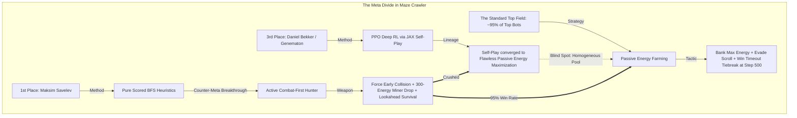
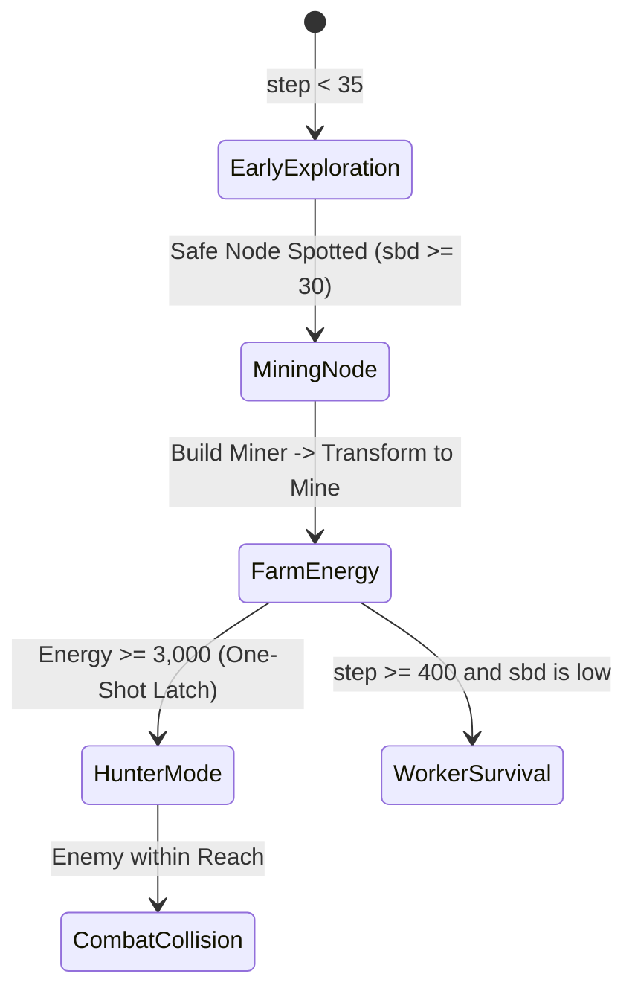
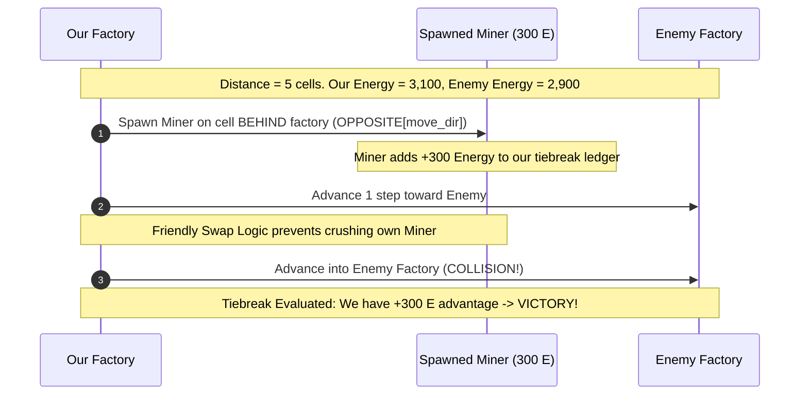
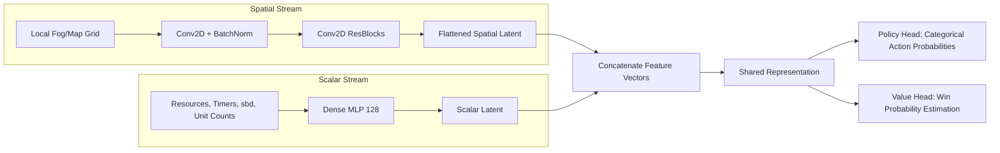
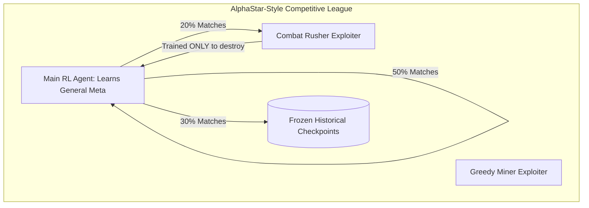

# Kaggle Maze Crawler Post-Mortem: Heuristic Supremacy vs. Deep Reinforcement Learning in Partial-Information RTS 🎮

> **Competition**: [Kaggle Maze Crawler](https://www.kaggle.com/competitions/maze-crawler)  
> **Track**: Reinforcement Learning & Simulation / Real-Time Strategy  
> **Authors Analyzed**: 
> - **1st Place**: Maksim Savelev (`Maksim Savelev`) — *Pure Heuristic Scored BFS*  
> - **2nd Place**: `bunterrrr` — *Combat-First Heuristic Mirror*  
> - **3rd Place**: Daniel Bekker (`Daniel Bekker` / Genematon) — *Deep RL with JAX Simulation & PPO Self-Play*  

---

## 1. Executive Summary & The Core Paradox

Kaggle **Maze Crawler** presented a 2-player partially-observable real-time strategy (RTS) simulation set in an infinite, fog-shrouded, northward-scrolling labyrinth. Two players control factory bases, deploying specialized robotic units (miners, workers, scouts) to harvest energy, tunnel through walls, expand vision, and outmaneuver an encroaching southern death boundary.

The competition's final leaderboard produced one of the most instructive case studies in competitive simulation:



### Key Breakthrough Takeaways:
1. **The Homogeneous Self-Play Blind Spot (3rd Place RL)**:
   - Daniel Bekker trained a high-performing PPO neural policy using a pure JAX simulator on GPUs and Behavioral Cloning bootstrap.
   - However, training against its own historical lineage produced a policy that perfected **energy maximization and long-term survival** ("energy play"). Because self-play agents never encountered aggressive, predatory ambushers, the model never learned to defend against direct combat rushers.
2. **The Counter-Meta Heuristic Hunter (1st Place)**:
   - Maksim Savelev realized that virtually all top competitors were optimizing for peaceful energy accumulation to win the step 500 tiebreak.
   - Rather than out-farming them, he engineered a **combat-first offensive hunter**: a single scored Breadth-First Search (BFS) that tracks steps-before-death (`sbd`), bank-latches energy at 3,000, hunts down the enemy factory, and drops a **300-energy Miner** immediately behind the advance right before collision (`TIEBREAK_DIST = 5`) to deterministically swing the collision energy tiebreak.
3. **The Engineering Lesson**:
   - In complex combinatorial games with fog of war and short timelines, a **tunable, transparent score-based heuristic** that targets the global meta-equilibrium can outperform deep neural policies that suffer from distribution shift or homogeneous self-play circularity.

---

## 2. Environment Mechanics & Rules of Engagement

To understand the tactical trade-offs, we first formalize the environment dynamics:

| Game Mechanic | Rules & Physics | Strategic Implication |
| :--- | :--- | :--- |
| **Board Geometry** | Grid with infinite northward expansion, horizontal bounds $[0, W-1]$. Left/right mirror symmetry across the central axis. | Lateral spawn symmetry allows predicting unrevealed wall layouts on the opponent's side. |
| **Fog of War** | Fog covers unvisited tiles; vision is provided by the factory and units (Scouts: high vision radius). | Exploring opponent territory is mandatory to target their base. |
| **Scrolling Death Line** | The southern boundary scrolls northward at a fixed rate. Any unit caught south of the boundary is instantly eliminated. | All pathfinding must evaluate **Steps-Before-Death (`sbd`)** at arrival time, not present time. |
| **Factory Base** | The main unit. Can move, jump across obstacles (with cooldown), and spawn units if energy and cooldown allow. | Factory destruction ends the match immediately. |
| **Miners & Mines** | Cost: $300\text{ energy}$. Can move or `TRANSFORM` into a stationary **Mine** on mining nodes. Mines produce energy but lose $1\text{ energy/tick}$ once placed. | Miners carry huge energy ($300$). Placing one right before factory collision drastically swings the tiebreak. |
| **Workers** | Cost energy. Specialized unit capable of tunneling/destroying maze walls to the north. | Essential late in the game when scrolling forces an escape through blocked passages. |
| **Scouts** | Low cost ($50\text{ energy}$). High mobility and vision. | Cheap reconnaissance; fanning out scouts builds map knowledge and contributes $50$ energy bundles to the tiebreak. |
| **Endgame & Tiebreak** | 1. Direct factory collision.<br>2. Timeout at step $500$.<br>**Tiebreak Winner**: The player with the highest total energy across all surviving units. | You do not need to destroy the enemy with combat units; you only need to touch their factory while possessing $>0$ energy margin. |

---

## 3. 1st Place Solution Autopsy: Maksim Savelev's Scored BFS

Maksim's architecture contains **no neural networks and no deep minimax/MCTS search tree**. It is built on three hierarchical layers:

```
Layer 3: Combat Win Condition (Factory Collision + Lookahead Miner Drop)
   ▲
Layer 2: Economy & Resource Latch (Node Mining -> ENERGY_CAP 3000 -> Hunter Shift)
   ▲
Layer 1: Movement Engine (Single Scored BFS with Jump-Aware Edge Expansion)
```

---

### Layer 1: The Jump-Aware Scored BFS Movement Module

Traditional BFS finds the shortest path by unweighted edge count. In Maze Crawler, agents can either **walk** (cost $1\text{ tick}$) or **jump** over obstacles (incurring a jump cooldown). 

Maksim implemented a **Jump-Aware BFS** that tracks state tuples for every reachable grid cell:
$$\text{cell\_best}[c, r] = (\text{arrival\_ticks}, \text{jump\_cd\_at\_arrival}, \text{first\_move}, \text{jumped\_flag})$$

Crucially, when two paths reach the same cell $(c, r)$—one requiring a jump and one via pure walking—the BFS does **not** blindly take the shorter path. Instead, it retains whichever path produces the **highest score**:

```python
def _score_cell(tbl, wm, c, r, ticks, jcd, width, south, north, spawn_col=None):
    # sbd: Steps Before Death (ticks until the southern scrolling line kills this row)
    # Evaluated at the FUTURE arrival tick, not current tick!
    sbd_arrival = (r - south) - ticks
    if sbd_arrival <= 0:
        return -1e9  # Fatal path: scrolling death line will catch us en route
    
    score = sbd_arrival * SBD_WEIGHT
    
    # Outer column penalty: wall traps along edges
    if c < EDGE_COLS or c >= (width - EDGE_COLS):
        score -= EDGE_PENALTY
        
    # One-shot cross bonus: encourage crossing the mirror axis into opponent territory
    if spawn_col is not None:
        is_opponent_side = (c > width // 2) if (spawn_col < width // 2) else (c < width // 2)
        if is_opponent_side:
            score += CROSS_BONUS
            
    return score
```

#### The Score Steering Principle:
Movement across the entire match is driven by a single function:
```python
def _pick_action(cell_best, tbl, wm, fc, fr, width, south, north, spawn_col=None, crossed=False, enemy_col=None):
    best_score = -float('inf')
    best_action = None
    
    for (c, r), (ticks, jcd, first, jumped) in cell_best.items():
        if r < fr:  # Never retreat south towards the advancing death boundary
            continue
            
        sc = _score_cell(tbl, wm, c, r, ticks, jcd, width, south, north, spawn_col if not crossed else None)
        
        # Enemy drift bonus: steer lateral movement toward opponent's last seen column
        if enemy_col is not None:
            col_distance = abs(c - enemy_col)
            sc += max(0, 3 - col_distance) * ENEMY_COL_BONUS
            
        if sc > best_score:
            best_score = sc
            best_action = first
            
    return best_action
```

- **Arrival-Time Steps-Before-Death (`sbd`)**: Prevents suicide paths where a cell is safe now, but the scrolling line engulfs it before the factory arrives.
- **Corridor Centering (`EDGE_PENALTY`)**: Avoids being pinned against side walls where escape options narrow.
- **Dynamic Enemy Column Steering (`ENEMY_COL_BONUS`)**: When the enemy is spotted in fog or lost from vision, the agent adds a decaying bonus for cells aligned with the enemy's column:
  $$\Delta \text{score} = \max(0, 3 - |c - c_{\text{enemy}}|) \times \text{ENEMY\_COL\_BONUS}$$
  Once the factory arrives in the same column, $|c - c_{\text{enemy}}| = 0$ is reached, eliminating stale lateral pulling.

---

### Layer 2: Economy & The One-Shot Resource Latch

The standard meta in Maze Crawler prioritized continuous node mining:
$$\text{Target Priority}: \quad \text{enemy} > \text{node} > \text{normal BFS}$$



#### 1. Safe Mining Commitment
When a node is detected, the factory moves to it **only if** $\text{sbd}_{\text{arrival}} \ge \text{MIN\_NODE\_SBD} = 30$. It deploys a Miner, commands it to `TRANSFORM` into a Mine, and parks the factory on the tile to harvest energy.

#### 2. The 3,000 Energy One-Shot Latch (`ENERGY_CAP`)
Almost all competitors farmed indefinitely. Maksim made a pivotal game-theoretic observation:
> *3,000 banked energy is mathematically sufficient to win any tiebreak. Continuing to farm after 3,000 energy yields diminishing returns while surrendering positional initiative.*

Once total energy crossed $3,000$, the agent permanently locked `ENERGY_CAP = 3000`. It **stopped visiting new mining nodes entirely** and converted $100\%$ of its computation and movement to hunting the enemy factory.

#### 3. Worker Survival Phase (`WORKER_PHASE_START = 400`)
If the match extended past turn $400$ and $\text{sbd}$ dropped dangerously low due to maze choke points, the factory spawned a **Worker** to excavate northern rock walls, opening escape corridors that unassisted BFS could not navigate.

---

### Layer 3: Combat Win Condition & The Tiebreak Miner Drop

This was the decisive differentiator that secured 1st place. The endgame rule states that factory-vs-factory collisions are decided by total remaining unit energy.

#### 1. Offensive Collision Seeking
While other bots treated collisions as fatal hazards to avoid until the step 500 timeout, Maksim treated **collision as the primary victory condition**:
- If the enemy factory is reachable in BFS: drop all mining tasks immediately and charge.
- Scout Deployment: Spawns a $50\text{-energy}$ Scout immediately after every factory jump (during the 1-tick recovery cooldown), dispersing them into the opponent's hemisphere to track the enemy base.

#### 2. The 300-Energy Miner Drop Trick
A Miner costs $300\text{ energy}$, instantly adding $300$ points to the player's collision tiebreak total.

```python
TIEBREAK_DIST           = 5   # Trigger when enemy Manhattan distance <= 5
TIEBREAK_ENERGY_MARGIN  = 50  # Must have >= 350 energy (300 for miner + 50 buffer)
TIEBREAK_MINER_LOOKAHEAD = 2  # Treat miners scrolled out within 2 ticks as dead
```

When closing in on the enemy:
1. **Drop Behind Advance**: The factory drops the Miner on the tile it just vacated (`OPPOSITE[last_move_dir]`). This guarantees the advancing factory does not crush its own miner on subsequent forward steps.
2. **Lookahead Death Avoidance**: If an existing miner would be scrolled out by the south boundary within $1\text{--}2$ ticks, it is marked as dead early, triggering a replacement build before the collision frame occurs.



---

### Friendly Collision Avoidance Subroutines

Because the factory outranks smaller units in the simulation physics engine, an uncoordinated step destroys friendly units. Maksim implemented unit reservation and position swapping:

```python
def _swap_with_miner(actions, obs, player, factory_uid, fc, fr):
    a = actions.get(factory_uid)
    if not a or a not in OFFSETS:
        return
    dc, dr = OFFSETS[a]
    target_c, target_r = fc + dc, fr + dr
    
    for uid2, robot in obs.robots.items():
        # If target cell contains our own Miner
        if robot[4] == player and robot[0] == MINER_TYPE and robot[1] == target_c and robot[2] == target_r:
            if robot[5] > 0:
                # Freshly spawned miner is on move cooldown -> CANNOT MOVE YET!
                # Wait 1 tick instead of crushing our own unit
                actions[factory_uid] = "IDLE"
            elif uid2 not in actions:
                # Swap positions: Miner moves in opposite direction of factory advance
                actions[uid2] = OPPOSITE[a]
            break
```

---

## 4. The Symmetric Rivalry: 1st Place vs. 2nd Place (`bunterrrr`)

During the evaluation window, a near-identical combat-first philosophy emerged from 2nd place competitor `bunterrrr`. However, `bunterrrr` ran **no scouts and zero node mining**, focusing exclusively on pure factory-to-factory hunting.

Head-to-head matches between 1st and 2nd were extremely close (~53% to 47% in Maksim's favor). The post-mortem highlighted a fundamental lesson in **unit physics and energy decay**:

> [!WARNING]
> **The Mine Energy Bleed Dynamic**:  
> In Maze Crawler, deployed Mines decay by $-1\text{ energy per tick}$.  
> - Maksim dropped the tiebreak miner at $\text{dist} = 5$.  
> - `bunterrrr` dropped their miner even later (closer to impact).  
> In matches where the collision took several extra maneuvering ticks, Maksim's miner lost $4\text{--}6$ energy due to tick decay, occasionally enabling `bunterrrr`'s fresher miner to edge out the tiebreak!

---

## 5. 3rd Place Solution Autopsy: Daniel Bekker's Deep Reinforcement Learning

Daniel Bekker (utilizing Genematon's experimental RL pipeline) built a full deep reinforcement learning agent trained via self-play.

### 1. Pure JAX Simulation on GPU
To provide the billions of samples required for RL to navigate a partially-observable labyrinth, the team developed a vectorized **JAX port** of the Maze Crawler environment. Running entirely on GPUs eliminated CPU-to-GPU data transfer overhead, enabling hundreds of thousands of simulation steps per second.

### 2. Behavioral Cloning (BC) Warm-Start
Starting PPO tabula rasa in a fog-shrouded maze with sparse collision rewards leads to immediate death against the scrolling line. Bekker bootstrapped the policy using **Behavioral Cloning**:
- Supervised training on match replay datasets published daily during the competition.
- Enabled the policy to master baseline survival, navigation, and resource gathering before RL fine-tuning.

### 3. Two-Stream Policy Architecture
To handle both spatial geometry and scalar game status, the policy employed a two-stream network:



### 4. Minimal Reward Engineering
Bekker discovered that dense reward shaping often degraded performance:
- Complex shaping terms (e.g., intermediate exploration rewards, mining bonuses) distorted the global objective, leading to reward hacking.
- **Winning Recipe**: Primary signal was pure match outcome ($\pm 1$). A single tiny, linear shaping term tied to net energy was added strictly to make value estimation tractable over 500-step episodes.

---

## 6. The Grand Synthesis: Why Did Deep RL Lose to Heuristics?

Comparing the 1st place heuristic agent and the 3rd place RL policy reveals why deep learning can struggle in competitive tournament ecosystems.

| Dimension | 1st Place (`Maksim Savelev`) | 3rd Place (`Daniel Bekker`) |
| :--- | :--- | :--- |
| **Agent Paradigm** | Deterministic Scored BFS Heuristics | Deep Reinforcement Learning (PPO) |
| **Training Compute** | $0\text{ GPU Hours}$ (Hand-tuned parameters) | Hundreds of GPU Hours (JAX + PPO self-play) |
| **Policy Flexibility** | Strict rule transitions and latch thresholds | Smooth neural probability distributions |
| **Strategic Stance** | **Aggressive Hunter**: Banks 3,000 E, then forces collision | **Passive Farmer**: Maximizes resource gathering and survives |
| **Endgame Tactic** | Spawns 300 E Miner behind factory right before collision | Relies on natural banked energy differential |
| **Field Performance** | $\mathbf{\sim 95\%}$ win rate vs. standard energy farmers | High win rate vs. standard field, vulnerable to combat rush |

### The Homogeneous Self-Play Trap

The fatal vulnerability of 3rd place's RL policy was **training population homogeneity**:

$$\mathcal{D}_{\text{train}} \sim \pi_{\text{self-play}}^{(t)} \times \pi_{\text{self-play}}^{(t-1)}$$

1. In self-play, both bots belong to the same lineage. If both players prioritize peace, surviving and hoarding energy is an optimal mutual strategy.
2. The agent never encountered an adversary whose sole objective was to rush across the map, drop a 300-energy unit behind its tail, and force a head-on collision at tick 120.
3. Because this adversarial behavior was absent from the self-play distribution, the value critic never learned that sitting on a mine with an enemy within 5 tiles represents a catastrophic loss state.

---

## 7. How to Fix the RL Blind Spot: AlphaStar League Exploiters

To train an RL agent capable of defeating 1st place in Maze Crawler, self-play must be augmented with **Adversarial Exploiter Agents**:



### The Fix in 3 Concrete Steps:
1. **Train a Combat Exploiter**: Initialize an auxiliary RL agent whose reward is $+1$ for colliding with the opponent factory regardless of energy, or train directly against a hard-coded heuristic rush bot (like Maksim's bot).
2. **Mix League Matchmaking**: Allocate $20\%$ of training rollouts to playing against the combat exploiter.
3. **Emergency Defensive Masking**: Force the policy critic to recognize close proximity of enemy units as a high-risk state requiring immediate combat deployment.

---

## 8. Battle-Tested Reusable Recipes & Anti-Patterns

### Reusable Recipe 1: Jump-Aware BFS with Score Steering
```python
def jump_aware_bfs(start_c, start_r, map_grid, max_ticks, score_fn):
    """
    Computes Pareto-optimal arrival paths considering both walking and jumping edges.
    Retains the path that maximizes score_fn, rather than blindly minimizing ticks.
    """
    import heapq
    
    # Priority queue: (-score, ticks, c, r, first_move, jcd)
    best_cells = {}
    queue = [(0, 0, start_c, start_r, None, 0)]
    
    while queue:
        neg_sc, ticks, c, r, first_m, jcd = heapq.heappop(queue)
        sc = -neg_sc
        
        if (c, r) in best_cells and best_cells[(c, r)][0] >= sc:
            continue
        best_cells[(c, r)] = (sc, ticks, first_m, jcd)
        
        if ticks >= max_ticks:
            continue
            
        # 1. Expand Walking Edges (adjacent 4-way)
        for dc, dr, action in [(-1, 0, 'LEFT'), (1, 0, 'RIGHT'), (0, 1, 'NORTH')]:
            nc, nr = c + dc, r + dr
            if map_grid.is_passable(nc, nr):
                cand_first = first_m if first_m is not None else action
                cand_sc = score_fn(nc, nr, ticks + 1)
                heapq.heappush(queue, (-cand_sc, ticks + 1, nc, nr, cand_first, max(0, jcd - 1)))
                
        # 2. Expand Jump Edges (distance 2 leap across obstacle)
        if jcd == 0:
            for dc, dr, action in [(-2, 0, 'JUMP_LEFT'), (2, 0, 'JUMP_RIGHT'), (0, 2, 'JUMP_NORTH')]:
                nc, nr = c + dc, r + dr
                if map_grid.is_passable(nc, nr):
                    cand_first = first_m if first_m is not None else action
                    cand_sc = score_fn(nc, nr, ticks + 1)
                    heapq.heappush(queue, (-cand_sc, ticks + 1, nc, nr, cand_first, 4)) # JUMP_COOLDOWN=4
                    
    return best_cells
```

---

### Critical Anti-Patterns to Avoid

| Anti-Pattern | Why It Failed in Maze Crawler | What to Do Instead |
| :--- | :--- | :--- |
| **Evaluating Safety at Current Tick ($t$)** | A cell at row $R$ might be 15 tiles ahead of the scrolling death line right now, but taking 16 ticks to reach it means the factory dies on arrival. | Always evaluate survival metrics ($\text{sbd}$) at the projected **arrival tick**: $\text{sbd}_{\text{arrival}} = (R - \text{south}) - t_{\text{arrival}}$. |
| **Greedy Infinite Resource Farming** | Continuing to mine nodes past 3,000 energy provided zero marginal win probability and surrendered map positioning to combat rushers. | Implement a **one-shot resource latch (`ENERGY_CAP`)**. Once sufficient to win tiebreaks, switch completely to predatory hunting. |
| **Homogeneous RL Self-Play Pools** | Self-play agents trained only against themselves converge to polite equilibrium strategies (peaceful farming), leaving them blind to aggressive rushes. | Incorporate **adversarial league exploiters** and heuristic sparring partners into the training distribution. |
| **Spawning Tiebreak Units in Front of Base** | Spawning a unit ahead of the advancing factory causes the factory to crush its own unit on the next forward tick. | Always spawn tiebreak units **directly behind the advance vector** (`OPPOSITE[move_dir]`) and verify unit cooldown before stepping. |
| **Complex Auxiliary Reward Shaping** | Adding arbitrary intermediate rewards for exploring or collecting sub-goals led the RL agent to hack intermediate rewards while missing the win condition. | Keep RL rewards strictly tied to **match outcome ($\pm 1$)**, with only minimal, smooth density terms. |
