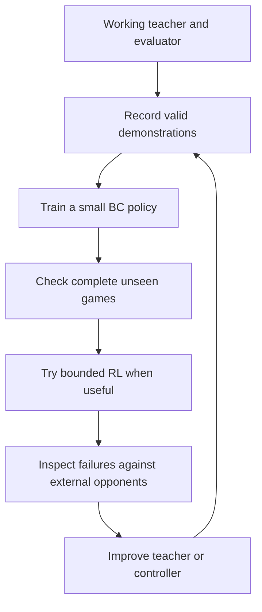

# A head start in the next simulation competition

The useful inheritance from Kaggriculture is a workflow: get a working agent, collect examples of competent play, evaluate a small learner, and improve the situations where it fails. That workflow can begin with your own baseline on the first day of a competition. It does not depend on a winning writeup already existing.

This is a proposed starting guide. The case studies explain particular competitions; they do not establish a universal best algorithm or a guaranteed leaderboard result.

## 1. What carries over, and what needs to change

| Lesson | Benefit in a new game | Re-derive this for the new competition |
| --- | --- | --- |
| A working heuristic or tape can be a teacher | BC starts from examples of useful behavior instead of exploring everything randomly | Whether good teachers exist, their permitted use, and what their actions actually control |
| Test the learner in complete games | Find errors that supervised prediction scores miss | Episode ending, scoring and the right held-out scenarios |
| Diagnose failures and improve demonstrations | Direct effort toward a specific weakness | Relevant situations: maps, opponents, resource shortages, time pressure, etc. |
| Legal actions can compete for shared resources | Avoid individually legal choices that fail together | Execution order, resource reservation, quantities and simultaneous-player effects |
| Keep an independent evaluation panel | Expose weaknesses that self-play misses | Player count, seat rotations, seeds, opponents and uncertainty |
| Measure simulation and serving cost early | Choose experiments that fit the deadline and hardware | Actual throughput, RAM/VRAM, CPU latency and submission limits |

The [Kaggriculture case study](kaggriculture.md) supplies a worked BC/PPO example. [Maze Crawler](maze-crawler.md) illustrates why a targeted heuristic and opponent diversity can matter. [Orbit Wars](orbit-wars.md) supplies examples of large-scale simulation and neural serving. Copy the relevant idea after checking the new game's requirements.

Do not carry over Kaggriculture's 719 decisions, replay index offset, farming features, final network size or `gamma=1` automatically. Similarly, Orbit Wars' archive cap, fleet geometry, model sizes and timing thresholds belong to that game's examples.

## 2. Start with the game contract and a runnable baseline

A **game contract** is a short, source-backed description of what the agent sees, what it can do, how the environment executes those choices and how results are scored. Read the official rules, environment code and submission documentation. Record versions and links; separate verified facts from assumptions.

Check player count, randomness, hidden information, action order, terminal conditions, illegal-action handling and runtime limits. A deterministic transition rule does not make private opponent information or future random events available to the actor.

Then run a baseline through a complete official game. Use the starter agent or a simple state-aware heuristic. Preserve the exact source and its result. A simulation competition begins to become manageable when you can run, inspect and repeat a game locally.

Before designing a large learner, establish four useful capabilities:

| Capability | Evidence to save |
| --- | --- |
| The agent works | A complete replay and terminal result from the official environment |
| Results can be compared | A repeatable evaluator with fixed seeds and appropriate player-position coverage |
| Experiments fit the machine | Measured simulation, encoding, inference and update costs; host RAM and GPU memory separately |
| The artifact can run at submission time | A local package that loads and emits valid actions within the documented target constraints |

A first package can be the heuristic. Packaging early catches interface and CPU-serving problems while the agent is still simple. A local check is not proof of acceptance by Kaggle's official runtime.

## 3. Choose the smallest useful approach

| What you find | A reasonable first experiment |
| --- | --- |
| A strong public or local rule-based agent | Improve it directly, or use its games for a small BC policy |
| A useful short-horizon simulator and a manageable action set | Try bounded search or planning, then measure its cost and match results |
| Good demonstrations, complex actions and sparse rewards | Try BC before RL; verify complete student games before extending training |
| Little teacher data but simple actions and informative rewards | A small direct RL experiment may be practical |
| A fixed grid with local interactions | Compare a compact grid model with simpler summaries |
| Many interacting, variable entities | Consider pooling, graph or entity models after the small baseline exposes a need |

**BC** means learning to imitate actions from recorded situations. **RL** means learning from consequences of the agent's own actions. **Search** tries possible futures before selecting a move. These can be combined, but combining them adds interfaces to verify.

Estimate wall time from measured throughput rather than borrowing a winner's step count. For illustration, one million decisions at 50 decisions/second takes about 5.6 hours for that measured component alone. At 1,000 decisions/second it takes about 17 minutes. Neither number predicts how many decisions will produce a strong policy.

Accelerate the bottleneck when the expected savings justify implementation and parity checking. Reusing a compatible engine may be useful; rewriting the simulator is a separate engineering investment.

## 4. When learning is justified, build it in stages



The diagram is one candidate learning route. Heuristic or search improvements remain valid alternatives when they use the available time better.

**Demonstrations:** save the observation available to the teacher, its identity, proposed/repaired/executed actions where relevant, terminal outcome and source version. Derive replay alignment from the new format. Two teacher seats may each contribute a trajectory, but both stay in the same data split. Deduplicate repeated game/seat rows across downloads. Define usable labels from the game's action semantics, rather than teaching impossible commands.

**BC:** start with a model and dataset that fit memory. Confirm that selected outputs change emitted actions. Evaluate rare but important decisions separately from frequent PASS/NONE choices. Test complete games, because student mistakes lead to states absent from teacher recordings. This distribution-shift problem is a general imitation-learning concern; methods that collect teacher guidance on student-visited states are another option when such queries are available. [Imitation-learning research](https://arxiv.org/abs/1011.0686).

**RL:** if using an actor-critic method, check whether the value estimate needs fitting before full policy updates. Kaggriculture preserved its BC actor while fitting the critic; that is an example, not a requirement for every algorithm. Match reward, discount and return construction to the new scoring and horizon. Distinguish true termination from collection cutoffs.

For PPO, retain old log probabilities and recompute them with matching masks, temperatures and sequential choices. Check agreement before updating weights. Represent deterministic forced components explicitly, instead of claiming the policy selected them. A frozen neural checkpoint can provide a probability-distribution anchor; an ordinary deterministic tape is a source of action labels and does not automatically supply that same regularizer.

**Failure analysis:** group losses by situations that matter in this game. For example, an RTS agent might lose on narrow maps or against early attacks. Improve the teacher/controller there, collect examples, and test the revised learner against the unchanged evaluation panel. Increased model size is another experiment, rather than the default response to every weakness.

## 5. Reuse infrastructure while replacing game-specific assumptions

| Reusable component | What the next game still needs |
| --- | --- |
| Match runner and result reporting | New environment API, scoring and player-position design |
| Replay recorder and dataset tools | New observation schema, action encoding and alignment |
| Experiment manifests and checkpoint tracking | New source/version identities and budget settings |
| Profiling and CPU package checks | The actual target runtime and resource limits |
| Opponent registry and failure reports | New baseline families and meaningful scenario groups |

Keep actor inputs identical to what is available at inference. When batching multiple players, build each player's input from that player's allowed observation. Sharing a batch or model does not authorize sharing private information between actor inputs.

Reserve development and final evaluation scenarios separately. In two-player games, swapping seats at a shared seed is useful. Multiplayer games need appropriate rotations or sampled assignments; single-player simulations need representative unseen scenarios. Preserve the scenario/seed grouping when estimating uncertainty.

A small gain against one opponent is an observation to investigate. Save the opponent version, sample count, outcome distribution and resource cost so that a later comparison remains meaningful.

## 6. A kickoff prompt for the next competition

Replace the URL, time remaining, hardware and budgets. Put the agent in the intended workspace. Explicit file references work even when the client does not automatically discover this repository's skill layout.

```text
Help me get a working head start in this simulation competition:
[COMPETITION_URL]

Time remaining: [DEADLINE_OR_DAYS_LEFT].
Hardware/OS: [GPU, VRAM, RAM, OS].
Initial work budget: [HOURS]; total local training budget: [MINUTES].

Use my kaggle-skills checkout. If it is absent, clone
https://github.com/kei-kochiya/kaggle-skills into a separate folder.
Read .agent/skills/kaggle-rl-simulation/SKILL.md and
Handbook/reinforcement-learning/simulation-competition-starter.md.
Use competition case studies only when relevant.

Create a directory for this competition. Verify current official rules,
environment/version, scoring, visible information, action execution and
submission constraints. Inspect public baseline source, not just titles.

Produce a runnable baseline, a repeatable evaluator, saved full-game
results/replays, a throughput/resource profile, and a local package check.
Keep a final evaluation panel untouched during development.

Choose among heuristic improvement, search, BC and RL using the game's
structure, measured results, available teachers and remaining time.
If prerequisites work and the budget permits, run one bounded improvement
experiment. A learning experiment should verify replay alignment,
action-to-execution behavior and, for PPO, probability/mask consistency.
Re-derive game-specific settings instead of copying Kaggriculture or Orbit
Wars defaults.

Save source/version identities, commands, results and the next experiment
in a short readable report. Distinguish measured results from estimates.
Keep the strongest verified agent. Proceed with useful work using available
information; ask only for missing details that materially affect the task.
Use local compute within these budgets and prepare artifacts locally.
```

The prompt specifies an outcome, useful context, constraints and observable evidence, leaving routine implementation choices to the agent. This follows [official OpenAI prompting guidance](https://developers.openai.com/api/docs/guides/reasoning-best-practices). Its first deliverable is a verified local foundation; leaderboard strength requires additional experiments.

## 7. Continue from evidence

After the first report, give the agent a specific next experiment and budget. For example: use the collected teacher replays to build a small BC policy, verify complete held-out games, and compare it with the preserved teacher on the development panel. Or improve the heuristic for a recurring failure before attempting learning.

A useful handoff names the current best agent, what actually ran, the measured bottleneck, available demonstrations and the next decision the experiment will resolve. A long training campaign becomes easier to justify when those facts are already available.
