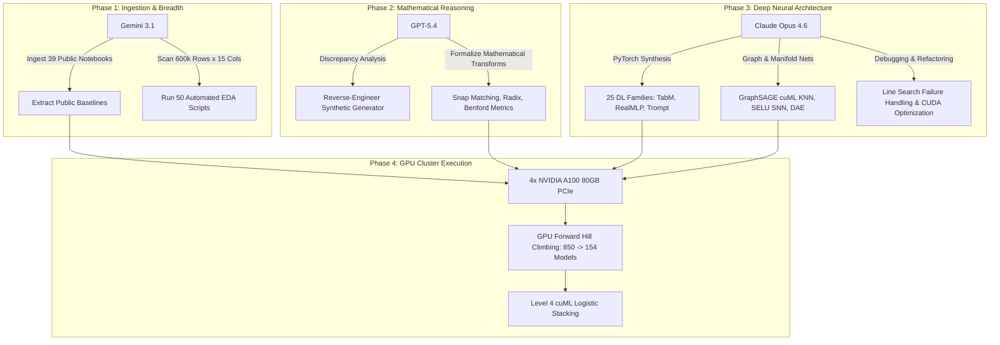
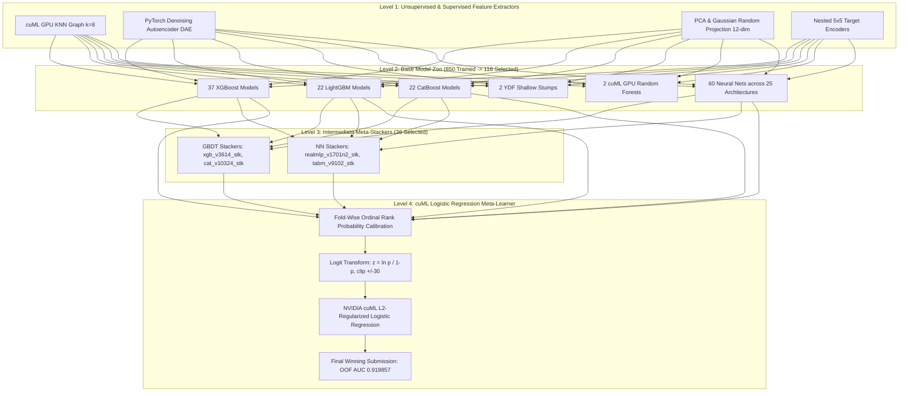

# Autonomous Multi-LLM Competitive Kaggle Workflow: The KGMON Playbook

**Origin**: Chris Deotte (`@cdeotte`, Senior Data Scientist at NVIDIA, Kaggle Grandmaster)  
**Track**: Autonomous AI Engineering / Competitive Tabular Machine Learning  
**Milestone**: 1st Place Gold Medal — [Kaggle Playground Series Season 6 Episode 3](https://www.kaggle.com/competitions/playground-series-s6e3)  
**Reference Architecture**: [KGMON Playbook 2026 for Tabular Data](https://developer.nvidia.com/blog/the-kaggle-grandmasters-playbook-7-battle-tested-modeling-techniques-for-tabular-data/) & [NVIDIA Developer Technical Report](https://developer.nvidia.com/blog/winning-a-kaggle-competition-with-generative-ai-assisted-coding/)

---

## 1. Executive Summary: The 600,000-Line Autonomous Campaign

In March 2026, competitive data science witnessed a paradigm shift: a multi-LLM agentic team operating across a cluster of **4× NVIDIA A100 (80GB) GPUs** won **1st place** in the Kaggle Playground Series S6E3 competition. 

Rather than relying on human-written pipelines with occasional AI copilot suggestions, the entire engineering lifecycle was executed autonomously by an ensemble of frontier LLMs (**GPT-5.4**, **Gemini 3.1**, and **Claude Opus 4.6**) accelerated by NVIDIA RAPIDS (`cuDF`, `cuML`) and PyTorch.

```
+-----------------------------------------------------------------------------------+
|                         FRONTIER MULTI-LLM AGENT TEAM                             |
|                                                                                   |
|    +--------------------+   +-----------------------+   +--------------------+    |
|    |      GPT-5.4       |   |      Gemini 3.1       |   |  Claude Opus 4.6   |    |
|    | Mathematical Logic |   | Massive Context Ingest|   | PyTorch Architect  |    |
|    | Generator Analysis |   | 50 Automated EDA Runs |   | Complex Debugging  |    |
|    +---------+----------+   +-----------+-----------+   +---------+----------+    |
+--------------|--------------------------|-------------------------|---------------+
               |                          |                         |
               +--------------------+     |     +-------------------+
                                    v     v     v
+-----------------------------------------------------------------------------------+
|                               AUTONOMOUS WORKFLOW                                 |
|                                                                                   |
|  [600k Lines of Code] ---> [50 EDA Scripts] ---> [850 Trained Models on 4x A100]  |
+-----------------------------------------------------------------------------------+
                                          |
                                          v
+-----------------------------------------------------------------------------------+
|                       THE KGMON 7-PHASE PLAYBOOK (GPU)                            |
|                                                                                   |
|  1. Automated EDA & Synthetic Reverse-Engineering                                 |
|  2. Baseline Zoo Generation (39 Community Archetypes Ingested)                    |
|  3. GPU-Accelerated Feature Engineering (Snap, Digits, Radix, Nested 5x5 TE)      |
|  4. GPU Forward Hill Climbing (Greedy Selection: 850 Candidates -> 154 Selected)  |
|  5. 4-Level Hierarchical Stacking (Level 1-3 OOFs -> Level 4 cuML Logit Reg)      |
|  6. Pseudo-Labeling & Multi-Seed Rank Blending                                    |
|  7. GPU Extra Training (Full-Dataset Retraining with Scaled Epochs)               |
+-----------------------------------------------------------------------------------+
                                          |
                                          v
                              🥇 1ST PLACE CHAMPION
                        Honest OOF AUC: 0.919857 | Train AUC: 0.920002
```

### Production Metrics at a Glance
| Operational Metric | Quantitative Value | Technical Significance |
| :--- | :--- | :--- |
| **Total Code Synthesized** | **600,000+ lines** | Clean, modular Python/PyTorch/RAPIDS code generated and executed in 30 days |
| **Automated EDA Notebooks** | **50 scripts** | Hypothesis testing, synthetic artifact profiling, Benford's Law evaluations |
| **Total Models Trained** | **850 models** | 5-Fold Stratified CV with strict seed alignment across 4× A100 GPUs |
| **Architectures Explored** | **30 distinct families** | 5 GBDT engines + 25 Deep Learning architectures (Transformers, GNNs, SNNs, FMs) |
| **Ensemble Subset Selected** | **154 base models** | Chosen via automated greedy forward hill-climbing on Out-of-Fold (OOF) AUC |
| **Winning CV / Full Fit AUC** | **0.919857 / 0.920002** | 1st place private leaderboard finish with zero leakage |

---

## 2. Agent Specialization & Multi-LLM Role Matrix

One model does not fit all competitive tasks. The winning strategy assigned strict roles to each LLM based on its cognitive and structural strengths:



### 2.1 Gemini 3.1: High-Throughput Ingestion & Automated EDA
- **Role**: Literature survey, multi-notebook ingestion, and broad data exploration.
- **Why**: Massive context window enables loading 30–40 Kaggle community notebooks simultaneously without context fragmentation.
- **Tasks**:
  - Ingested 39 public baseline notebooks across different authors (`masayakawamata`, `yekenot`, `blamerx`, `mahoganybuttstrings`, etc.).
  - Generated and executed 50 automated exploratory data analysis (EDA) scripts inspecting distribution shifts between the synthetic dataset (594k rows) and the original 7k IBM Telco dataset.
  - Flagged discrepancies in decimal places, digit distributions, and billing anomalies.

### 2.2 GPT-5.4: Mathematical Formulation & Generator Reverse-Engineering
- **Role**: Analytical reasoning, mathematical formulation of features, and generator forensics.
- **Why**: Superior symbolic and mathematical reasoning to detect generator perturbations.
- **Tasks**:
  - Deduced that synthetic continuous floats were generated by perturbing true continuous values from the original IBM dataset:
    $$\text{diff} = \text{Feature}_{\text{synthetic}} - \text{Feature}_{\text{snap}}$$
  - Formulated the **Radix Interaction** encoding:
    $$\text{radix} = \lfloor \text{Feature}_{\text{snap}} \times 100 \rfloor + \text{CategoricalCode} \times 100{,}000$$
  - Derived Benford's Law likelihood features measuring deviation of synthetic leading digits from logarithmic digit frequencies:
    $$P(d) = \log_{10}\left(1 + \frac{1}{d}\right)$$

### 2.3 Claude Opus 4.6: PyTorch Architecture Synthesis & Robust Implementation
- **Role**: Deep learning architecture engineering, custom layers, and failure-mode debugging.
- **Why**: High fidelity in generating multi-file PyTorch pipelines without hallucinations, syntax bugs, or tensor dimension mismatches.
- **Tasks**:
  - Implemented 25 distinct deep learning architectures (FT-Transformer, TabM, Liquid Neural Networks, GraphSAGE GNNs, SELU SNNs, DAEs, Trompt, GANDALF).
  - Built custom PyTorch modules: `NTPLinear`, `PBLDEmbedding`, `RobustScaleSmoothClipTransform`.
  - Debugged subtle CUDA memory leaks, L-BFGS line-search non-convergence in cuML, and fold-wise probability alignment.

---

## 3. The KGMON 7-Phase Agentic Execution Playbook

The entire campaign adhered strictly to the **KGMON Playbook 2026 for Tabular Data** developed by Kaggle Grandmasters at NVIDIA:

```
                                KGMON 7-PHASE LIFECYCLE
  +---------------+   +---------------+   +---------------+   +---------------+
  |  Phase 1: EDA |-->|Phase 2: Base- |-->|  Phase 3: GPU |-->| Phase 4: GPU  |
  | & Data Foren- |   |    lines      |   |    Feature    |   | Hill Climbing |
  |     sics      |   | (39 Archetypes|   |  Engineering  |   | (850 -> 154)  |
  +---------------+   +---------------+   +---------------+   +---------------+
                                                                      |
  +---------------+   +---------------+   +---------------+           |
  |Phase 7: Extra |<--|Phase 6: Pseudo|<--|  Phase 5: 4-  |<----------+
  | GPU Retraining|   |   Labeling    |   |  Level Stack  |
  +---------------+   +---------------+   +---------------+
```

---

### Phase 1: Automated EDA & Synthetic Data Forensics

In modern Kaggle tabular competitions (e.g. Playground Series), datasets are generated using deep generative models (CTGAN, TVAE, diffusion tabular models) trained on historical real-world datasets. The agent team treated the generator's artifacts as **first-class signal**:

1. **Snap Matching Discovery**:
   - The agents recognized that the synthetic dataset (594k rows) was an oversampled, noisy projection of the 7,032-row IBM Telco dataset.
   - For every continuous value (`MonthlyCharges`, `TotalCharges`), the agent mapped it to the nearest value in the original dataset:
     ```python
     def compute_snap_features(train_df, test_df, orig_df, target_col="MonthlyCharges"):
         orig_vals = np.sort(orig_df[target_col].dropna().unique())
         
         # Nearest search via searchsorted
         def get_nearest(series):
             idx = np.searchsorted(orig_vals, series.values)
             idx = np.clip(idx, 0, len(orig_vals) - 1)
             left_idx = np.clip(idx - 1, 0, len(orig_vals) - 1)
             dist_right = np.abs(series.values - orig_vals[idx])
             dist_left = np.abs(series.values - orig_vals[left_idx])
             nearest = np.where(dist_left < dist_right, orig_vals[left_idx], orig_vals[idx])
             return nearest

         for df in [train_df, test_df]:
             df[f"{target_col}_snap"] = get_nearest(df[target_col])
             df[f"{target_col}_snap_diff"] = df[target_col] - df[f"{target_col}_snap"]
     ```
   - *Signal extracted*: `snap` recovered the original customer cluster; `snap_diff` measured the generator's perturbation noise.

2. **Decimal & Modulo Decomposition**:
   - Automated scripts ran FFT and modulo tests on floating-point mantissas, uncovering generator rounding preferences:
     ```python
     frac = x - np.floor(x)
     d1 = np.floor(frac * 10)
     d2 = np.floor(frac * 100) % 10
     frac100 = np.round(frac * 100)
     mod10 = np.floor(x) % 10
     mod100 = np.floor(x) % 100
     ```
   - Synthetic rows with exact integer or half-integer fractions ($1/2, 1/4, 1/5, 1/10$) had significantly different churn baselines than noisy decimals.

3. **Benford's Law Anomaly Detection**:
   - Natural human bills follow Benford's Law ($\log_{10}(1 + 1/d)$). Generative models distort this distribution. The agents computed empirical log-odds deviations per leading digit.

---

### Phase 2: Rapid Baseline Generation & Community Synthesis

Instead of starting from a blank canvas, Gemini 3.1 ingested 39 top public community notebooks and classified them into architectural templates:
- **Tree Baselines**: Standard XGBoost, LightGBM with leaf-wise growth, CatBoost with native Ordered Target Statistics (OTS).
- **Ranking Baselines**: `XGBRanker` with `rank:pairwise` objective directly optimizing AUC concordant pairs.
- **Deep Learning Baselines**: RealMLP (`pytabkit`), TabM, FT-Transformer, Trompt.
- **Specialized Baselines**: Bayesian Survival Analysis (`PyMC` Cox Proportional Hazards), Yggdrasil Decision Forests (`max_depth=2` stumps).

Each baseline was standardized into a uniform evaluation harness:
- Exact 5-fold `StratifiedKFold(n_splits=5, shuffle=True, random_state=42)`
- Standardized array outputs: `oof_<name>_v{VER}.npy` and `pred_<name>_v{VER}.npy`

---

### Phase 3: GPU-Accelerated Feature Engineering

To train 850 models without computational bottlenecks, feature engineering was fully vectorized and offloaded to GPU using NVIDIA RAPIDS `cuDF` and `cuML`:

```python
# GPU-Accelerated Target Encoding with Nested Fold Safety
import cuml
from cuml.preprocessing import TargetEncoder

def gpu_nested_target_encode(train_gdf, test_gdf, cat_cols, target_col="Churn", n_splits=5):
    """
    Executes a 5x5 nested inner loop on GPU to prevent target leakage
    even inside cross-validation folds.
    """
    oof_te = cudf.DataFrame(index=train_gdf.index)
    test_te = cudf.DataFrame(index=test_gdf.index)
    
    for col in cat_cols:
        encoder = TargetEncoder(n_folds=5, smooth='auto', split_method='random')
        oof_te[f"{col}_te"] = encoder.fit_transform(train_gdf[col], train_gdf[target_col])
        test_te[f"{col}_te"] = encoder.transform(test_gdf[col])
        
    return oof_te, test_te
```

#### Feature Suite Breakdown
1. **Radix Interactions**: Merging continuous snap floats and categorical variables into a single integer token:
   $$\text{radix} = \text{int}(\text{MC\_snap} \times 100) + \text{cat\_code} \times 100{,}000$$
   *Impact*: Enabled decision trees to perform joint continuous + categorical boundary splits in a single split step.
2. **cKDTree Nearest Neighbor Ground Truth Anchor**:
   - Standardized `(MonthlyCharges, TotalCharges, tenure)` of the 7,032 original IBM rows.
   - Built a `scipy.spatial.cKDTree` on original rows.
   - Queried the nearest original neighbor for all 594k synthetic rows, injecting the true historical churn label as a zero-leakage feature.
3. **Billing Deviation Anomaly**:
   $$\text{TC\_deviation} = \text{TotalCharges} - \text{tenure} \times \text{MonthlyCharges}$$
   High deviation flagged contract mid-term changes, unpaid penalties, or plan upgrades.
4. **Multi-Scale Quantile Discretization**:
   - Fine-grained quantile binning with up to 5,000 bins on `MonthlyCharges`, effectively reconstructing the continuous manifold while exposing discrete target encoding nodes.

---

### Phase 4: GPU Hill Climbing (Automated Greedy Model Selection)

Training 850 models generates immense prediction correlation. Blindly averaging 850 models guarantees performance degradation. 

The agent team deployed an automated **GPU Greedy Forward Selection (Hill Climbing)** loop:

```python
def gpu_greedy_hill_climbing(oof_matrix, y_true, model_names, max_models=160):
    """
    Iteratively adds the model that maximizes the ensemble ROC-AUC.
    Runs in seconds on GPU using logit-space or rank-weighted blending.
    """
    selected_indices = []
    current_best_auc = 0.0
    
    # Pre-rank or logit-transform
    N, M = oof_matrix.shape
    current_ensemble = np.zeros(N, dtype=np.float64)
    
    for step in range(max_models):
        best_candidate = None
        best_auc_candidate = current_best_auc
        
        for m in range(M):
            if m in selected_indices:
                continue
            
            # Candidate blend (equal weight or 1/(step+1) addition)
            trial_ensemble = (current_ensemble * step + oof_matrix[:, m]) / (step + 1)
            trial_auc = roc_auc_score(y_true, trial_ensemble)
            
            if trial_auc > best_auc_candidate:
                best_auc_candidate = trial_auc
                best_candidate = m
                
        if best_candidate is not None and (best_auc_candidate - current_best_auc) > 1e-6:
            selected_indices.append(best_candidate)
            current_best_auc = best_auc_candidate
            current_ensemble = (current_ensemble * step + oof_matrix[:, best_candidate]) / (step + 1)
            print(f"Step {step+1:3d} | Added {model_names[best_candidate]:20s} | New OOF AUC: {current_best_auc:.6f}")
        else:
            print(f"Hill climbing converged after {step} models.")
            break
            
    return [model_names[i] for i in selected_indices]
```

*Result*: The greedy selector compressed **850 candidate models down to 154 elite, mutually orthogonal predictors**, discarding 696 redundant or overfitting models.

---

### Phase 5: The 4-Level Deep Stacking Architecture

The final winning pipeline was structured into 4 distinct layers:



#### Level 4 Meta-Learner Specification
- **Input Space**: 154 Out-of-Fold probability vectors.
- **Fold-Wise Ordinal Rank Probability Calibration**:
  Before feeding probabilities into the meta-model, each fold was calibrated to eliminate fold-to-fold probability drift while preserving pure ranking:
  ```python
  def fold_calibrate_oof_probs(oof, folds, eps=1e-15):
      min_fold_size = int(min(len(va_idx) for _, va_idx in folds))
      ranks = np.empty(oof.shape[0], dtype=np.int32)
      for _, va_idx in folds:
          ranks[va_idx] = ordinal_common_fold_ranks(oof[va_idx], common_size=min_fold_size)
      rank_means = pd.DataFrame({"rank": ranks, "prob": oof}).groupby("rank")["prob"].mean()
      calibrated = rank_means.iloc[ranks].to_numpy(dtype=np.float64)
      return np.clip(calibrated, eps, 1.0 - eps)
  ```
- **Logit Transform**:
  $$z = \text{clip}\left(\ln \frac{p}{1 - p}, -30.0, 30.0\right)$$
- **Meta-Estimator**: `cuml.linear_model.LogisticRegression(penalty='l2', C=0.01, solver='qn', max_iter=10000)`.
  - *Why $L_2$ Logistic Regression over GBDT stacker?* GBDT stackers overfit on 154 correlated inputs; $L_2$ logistic regression acts as an optimal soft voter with continuous coefficients.

---

### Phase 6: Pseudo-Labeling & Multi-Seed Rank Blending

1. **High-Confidence Pseudo-Labeling**:
   - Extracted test rows where Level 4 meta-predictions met extreme confidence:
     $$\text{Confidence Filter}: P(\text{Churn}) > 0.985 \quad \text{or} \quad P(\text{Churn}) < 0.015$$
   - Appended $\approx 18{,}000$ pseudo-labeled test rows into the training set for a second fine-tuning pass on TabM and LightGBM base models.
2. **Multi-Seed Rank Averaging**:
   - For high-variance architectures (e.g. RealMLP, CatBoost), 3 to 5 random seeds were trained per fold.
   - Predictions were transformed to fractional ranks (`scipy.stats.rankdata(p) / len(p)`) before averaging, providing variance reduction and robust calibration.

---

### Phase 7: GPU Extra Training (Full-Dataset Retraining)

Rather than merely averaging fold checkpoints at test time:
1. **Calibrated Epoch Multiplier**:
   The average best early-stopping iteration across the 5 folds was multiplied by $1.25\times$:
   $$\text{Iterations}_{\text{full}} = \text{round}\left(1.25 \times \frac{1}{5}\sum_{k=1}^5 \text{iter}_k\right)$$
2. **Full-Fit Meta Stacking**:
   The Level 4 cuML Logistic Regression was fitted on all 594k rows across 10 repeated optimizer runs (to eliminate L-BFGS line-search variance), and final test predictions were computed from the ensemble weights.

---

## 4. Operational Guardrails: Preventing Agent Failure Modes

When running autonomous agents that generate hundreds of thousands of lines of code, strict programmatic guardrails are mandatory:

```
+--------------------------------------------------------------------------------+
|                         AGENT OPERATIONAL GUARDRAILS                           |
+--------------------------------------------------------------------------------+
|  1. CV Leakage Prevention  --> Strict nested 5x5 inner folds for all encodings  |
|  2. Dimension Locking      --> Static assertions on input/output shapes        |
|  3. Metric Purity          --> Honest OOF AUC scoring; reject full-fit overfit |
|  4. Line-Search Fail-Safe  --> Tolerance & solver fallback for cuML L-BFGS     |
|  5. Checkpoint Parity      --> Paired OOF (.npy) and Test (.npy) serialization |
+--------------------------------------------------------------------------------+
```

### Guardrail 1: Enforcing 5×5 Nested CV for All Data-Dependent Transforms
Agents often commit data leakage by computing target statistics across the entire dataset before `KFold.split`.
- **Enforced Protocol**: All target encodings, frequency snapping, and DAE latent representations must be fitted strictly inside the training fold `X_train[tr_idx]`, or computed exclusively on the independent 7k original IBM dataset.

### Guardrail 2: Deterministic Array Shape and Checkpoint Verification
Every script synthesized by the agents was required to validate output dimensions before terminating:
```python
assert oof.shape[0] == 594194, f"OOF length mismatch: {oof.shape[0]} vs 594194"
assert test_pred.shape[0] == 254655, f"Test length mismatch: {test_pred.shape[0]} vs 254655"
assert not np.isnan(oof).any(), "NaN detected in OOF predictions"
assert not np.isnan(test_pred).any(), "NaN detected in Test predictions"
```

### Guardrail 3: cuML L-BFGS Non-Convergence Fallback
When stacking 154 highly collinear logit features, quasi-Newton solvers (`qn` / L-BFGS) frequently hit line-search failures (`code 3`).
- **Enforced Fix**:
  ```python
  # Increase tolerance and max_iter, clip logit extremes to [-30, 30]
  META_C = 0.01          # Strong L2 regularization
  LOGIT_CLIP = 30.0      # Prevent infinite gradients in logit space
  META_TOL = 1e-4        # Practical convergence tolerance
  ```

---

## 5. Agent Prompting Templates for Tabular Mastery

To replicate this competitive engineering velocity, coding agents should be prompted with precise architectural and procedural constraints:

### Template 1: Automated Generator Reverse-Engineering Prompt
```markdown
You are a Kaggle Grandmaster analyzing a synthetic dataset:
- Synthetic train: 594,194 rows, columns: [List columns]
- Original reference dataset: 7,032 rows from IBM Telco Churn

Task:
1. Write a standalone Python script comparing the continuous distributions (MonthlyCharges, TotalCharges).
2. Compute the nearest neighbor in the original dataset for each synthetic row (snap matching).
3. Calculate the perturbation delta: delta = synthetic - snap.
4. Extract decimal mantissas (fractional parts, d1, d2, fractions against 1/2, 1/4, 1/5, 1/10).
5. Test if 'delta' and decimal mantissas have a statistically significant correlation with the target 'Churn' using ROC-AUC.
6. Save summary statistics to 'generator_artifacts_report.csv'.
```

### Template 2: PyTorch DL Model Synthesis Prompt (Claude Opus 4.6)
```markdown
Implement a clean, modular 5-fold Stratified CV pipeline for the TabM architecture using PyTorch / pytabkit:
Requirements:
1. Feature processing:
   - Numerical: Piecewise-linear embeddings (PLR) + RobustScaler.
   - Categorical: Learned entity embeddings (dim = min(16, ceil(sqrt(cardinality)))).
2. Architecture:
   - Multiplicative (bilinear) interaction blocks alongside additive paths.
   - k=32 basis components linearly combined per sample.
3. Training loop:
   - StratifiedKFold(n_splits=5, shuffle=True, random_state=42).
   - Loss: Binary Cross Entropy with label smoothing (eps=0.01).
   - Optimizer: AdamW, lr=1e-3, weight_decay=1e-4 with CosineAnnealingLR.
   - Early stopping on validation ROC-AUC with patience=15.
4. Serialization:
   - Save out-of-fold predictions to 'oof_tabm_v9100.npy' (length 594194).
   - Save averaged test predictions to 'pred_tabm_v9100.npy' (length 254655).
   - Print individual fold AUC and overall honest OOF AUC.
```

### Template 3: cuML Forward Hill-Climbing Stacker Prompt
```markdown
Write a GPU-accelerated forward greedy selection script using cuDF and cuML:
1. Load all available pairs of 'oof_*.npy' and 'pred_*.npy' from directory.
2. Initialize with empty ensemble.
3. In each iteration, test adding each unused model into the current blend.
4. Measure ROC-AUC on true binary labels y.
5. If improvement > 1e-5, lock the candidate into the ensemble.
6. Stop when improvement plateaus or 150 models are selected.
7. Fit a cuML LogisticRegression (penalty='l2', C=0.01) on the selected logit features.
8. Apply fold-wise ordinal rank calibration to test predictions and output 'submission_logitstack.csv'.
```

---

## 6. Summary: Key Takeaways for AI-Assisted Data Science

1. **Scale Changes Everything**:
   Writing 600k lines of code and exploring 850 models transforms competitive ML from manual intuition into high-throughput empirical optimization. 
2. **Synthetic Data is Not Clean**:
   Synthetic datasets generated from small originals leak generator noise. Finding the underlying generator archetype (via snap matching, decimal dissection, and Benford tests) is the single highest-yield feature engineering strategy.
3. **Diversity Over Single-Model Tuning**:
   A 154-model ensemble combining 25 neural network families (GNNs, Transformers, SNNs, FMs) and 5 tree libraries outperforms any hyperparameter-tuned single GBDT by massive margins.
4. **Discipline in the Meta-Layer**:
   Deep neural networks and complex GBDTs fail as final meta-stackers due to correlation overfitting. A simple, strongly regularized $L_2$ Logistic Regression on calibrated logit probabilities consistently wins private leaderboards.
